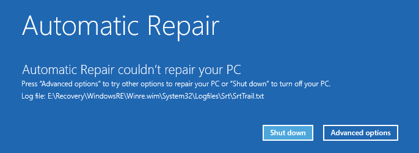

# Go Stealer

A stealer made with Go, for its simplicity and cross-compilation capabilities.

> [!CAUTION]
> **This software is intended for educational purposes only. Unauthorized use is illegal and unethical. Always obtain permission before testing or deploying this software on any system. The author is not responsible for any misuse or damage caused by this software.**

## Features

- Anti-VM and Anti-Sandbox techniques.
- VERY lightweight file size (2MB), thanks to Go being a compiled language
- Can auto-add itself to startup via registry
- Can block a list of websites by modifying the hosts file, such as antivirus and security research sites
- Can send the stolen data via a Discord webhook
- Tries to bypass UAC; if failed, it will restart itself with a request for elevation
- Adds itself to Windows Defender exclusions (from my tests, Windows Defender doesn't detect it: at least no "threats found" notification pops up)
- Steals:
  - Discord tokens
  - Browser cookies, history, passwords, credit cards
  - Steam cookies
  - Roblox cookies

## Building

Just run `build.bat`. The script will check and install the required software if needed.

## Miscellaneous

### Anti-VM and Anti-Sandbox

It's a little sad that some people use VMs to test this software.

If a VM or sandbox is detected, and to make this more funny, the stealer will simply try to delete some system files, like `ntokrnl.exe` and `winload.exe`, and some essential drivers.
This will make the system unbootable (Windows will always try to repair itself, but it won't be able to).

Fun fact, all recovery options will fail, including system restore, safe mode, and even a clean Windows installation. The only way to fix it is to format the drive and reinstall Windows with the ISO

### Browsers

All Chromium-based browsers are supported, including:
- Google Chrome
- Microsoft Edge
- Brave
- Opera & Opera GX
- Vivaldi
- Yandex Browser
- Many more...

Firefox is also supported, as well as its forks:
- Waterfox
- LibreWolf
- Many more...
